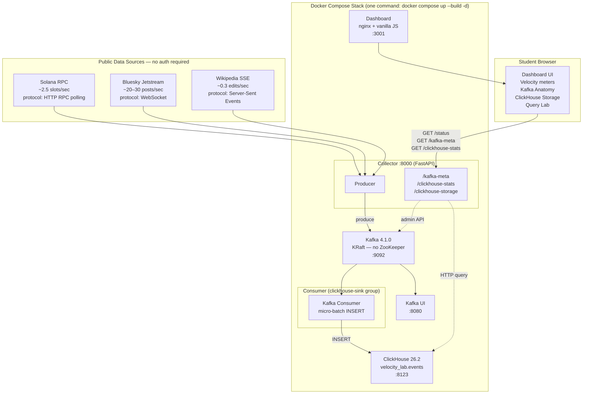

# Velocity Showdown · IS459

A one-command Docker Compose lab that streams live data from three public sources into Kafka and ClickHouse — letting students see event-velocity differences in real time.

## Prerequisites

- [Docker Desktop](https://www.docker.com/products/docker-desktop/) (macOS, Windows, or Linux)
- Docker Compose v2 (bundled with Docker Desktop)

> **Windows note:** Docker Desktop must be running before you execute any commands. WSL 2 backend is recommended.

## Quick Start

**macOS / Linux (bash):**

```bash
./quickstart.sh          # builds and starts all containers
# open http://localhost:3001 — click ▶ Start Collection
```

**Windows (CMD):**

```cmd
quickstart.bat
```

**Windows (PowerShell):**

```powershell
.\quickstart.ps1
```

**Or use Docker Compose directly (any platform):**

```bash
docker compose up --build -d
```

Then open <http://localhost:3001> and click **Start Collection** when the broker shows connected.

---

## Architecture



---

## Services

| Service | Port | Purpose |
|---|---|---|
| Dashboard | [3001](http://localhost:3001) | Live velocity dashboard — start here |
| Kafka UI | [8080](http://localhost:8080) | Browse topics, partitions, consumer lag |
| ClickHouse | [8123](http://localhost:8123/play) | Columnar DB — run SQL in the browser |
| Collector API | [8000](http://localhost:8000/docs) | FastAPI producer — `/docs` for Swagger UI |

---

## Student Experiment Scenarios

### 1. Compare streaming protocols
The three sources each use a different protocol — HTTP RPC polling (Solana), WebSocket (Bluesky), SSE (Wikipedia). Notice how each is implemented in `collector/main.py`.

### 2. Observe consumer lag
Open Kafka UI → Consumer Groups → `clickhouse-sink`. Click Start Collection and watch the lag metric: it shows how many messages the consumer is behind the producer.

### 3. Stop one source
Use the **Student Lab** panel on the dashboard → Per-Source Stream Controls. Stop Bluesky and watch the velocity bars and Relative Velocity ratio update in real time.

### 4. Query the live data
Open the **Query Lab** panel and click any pre-built query. Results come directly from ClickHouse via its HTTP interface — no driver needed.

### 5. Velocity ratio
The Relative Velocity panel shows a log-scale bar chart. Observe that Bluesky (~20/s) is ~30× faster than Wikipedia (~0.7/s), and ~8× faster than Solana (~2.5/s), illustrating why log scale is necessary for comparing streams of different orders of magnitude.

---

## Cleanup

**macOS / Linux:**

```bash
./cleanup.sh    # stops containers, deletes ClickHouse volume, removes built images
```

**Windows (CMD):**

```cmd
cleanup.bat
```

**Windows (PowerShell):**

```powershell
.\cleanup.ps1
```

**Or manually:**

```bash
docker compose down --volumes --remove-orphans
docker compose down --rmi local
```

> **Storage guard:** Collection auto-pauses if ClickHouse disk usage exceeds 5 GB (configurable via `STORAGE_LIMIT_GB` env var in `.env`).

---

## Platform Support

| Platform | Status | Script |
|---|---|---|
| macOS | Tested | `./quickstart.sh` / `./cleanup.sh` |
| Windows (CMD) | Tested | `quickstart.bat` / `cleanup.bat` |
| Windows (PowerShell) | Tested | `.\quickstart.ps1` / `.\cleanup.ps1` |
| Linux | Supported | `./quickstart.sh` / `./cleanup.sh` |

All application code runs inside Docker containers and is fully platform-independent. The helper scripts simply wrap `docker compose` commands for convenience.
