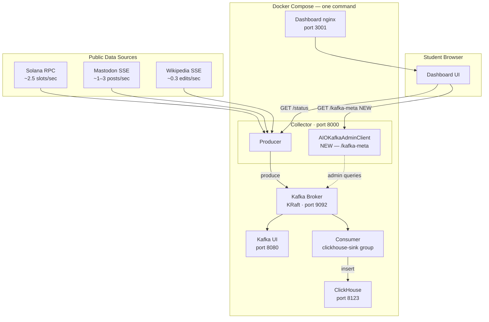
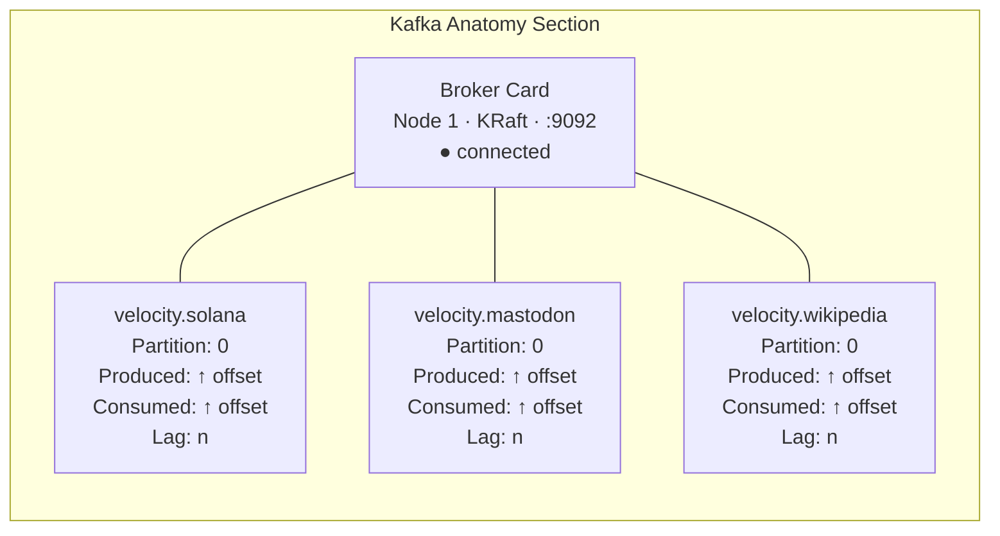
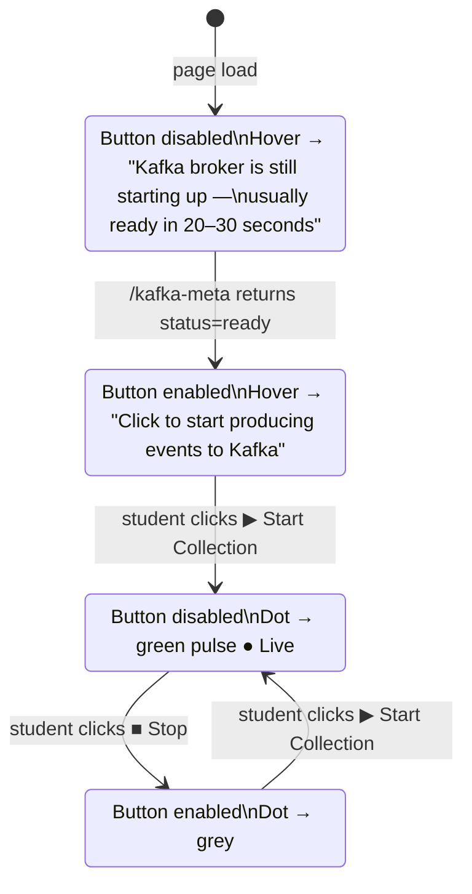
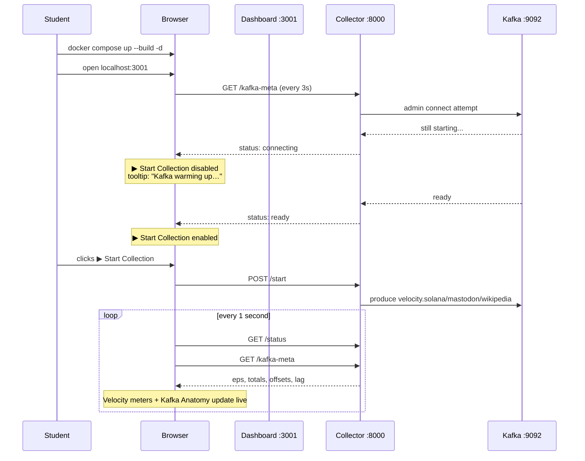

# Student-Friendly Dashboard Design
**Date:** 2026-03-16
**Project:** IS459 · Big Data Architecture · Week 7 — Velocity Showdown
**Status:** Approved

---

## Goal

Make the project immediately accessible to students with zero terminal knowledge beyond one command. Students open a browser, click Start, and see live streaming data alongside Kafka internals — learning velocity and Kafka mechanics visually without reading documentation first.

---

## Architecture



---

## Changes Required

### 1. Collector — `/kafka-meta` endpoint

**File:** `collector/main.py`

New `GET /kafka-meta` endpoint using `AIOKafkaAdminClient` (already available via `aiokafka`).

**Response shape:**
```json
{
  "broker": {
    "node_id": 1,
    "host": "kafka",
    "port": 9092,
    "mode": "KRaft",
    "status": "ready"
  },
  "topics": {
    "velocity.solana": {
      "partition": 0,
      "producer_offset": 1482,
      "consumer_offset": 1480,
      "lag": 2
    },
    "velocity.mastodon": {
      "partition": 0,
      "producer_offset": 347,
      "consumer_offset": 345,
      "lag": 2
    },
    "velocity.wikipedia": {
      "partition": 0,
      "producer_offset": 91,
      "consumer_offset": 90,
      "lag": 1
    }
  },
  "consumer_group": "clickhouse-sink"
}
```

**Implementation details:**
- `AIOKafkaAdminClient` fetches topic partition metadata → broker host/port/node_id
- `list_consumer_group_offsets("clickhouse-sink")` → consumer offsets per partition
- `AIOKafkaConsumer.end_offsets()` → latest (producer) offsets per partition
- Result cached in memory for 2 seconds — prevents per-request Kafka admin overhead
- Returns `"status": "connecting"` with zero offsets if Kafka is not yet reachable — safe to call before Start is clicked
- `broker.status` flips to `"ready"` once the admin client successfully connects

---

### 2. Dashboard — Kafka Anatomy Section

**File:** `dashboard/index.html`

New section inserted between the velocity meters and the existing bottom comparison panels.



**Educational tooltips** — CSS-only `ⓘ` icons on every Kafka term:

| Term | Tooltip |
|---|---|
| Broker | The Kafka server. Stores messages and serves producers & consumers. |
| KRaft | No ZooKeeper needed — Kafka manages its own consensus since v3.3. |
| Partition | Topics are split into ordered partitions. 1 partition = 1 ordered log. |
| Produced offset | Every message gets a sequential number. This is how many have been written. |
| Consumed offset | Where the `clickhouse-sink` consumer group is up to. |
| Lag | Gap between produced and consumed. Low lag = consumer keeping up. |

**Visual rules:**
- Offsets formatted as `K`/`M` (e.g. `14.2K`) — prevents overflow
- Lag colour coding: ≤5 → green, 6–20 → amber, >20 → red
- Topic colours match existing scheme: teal (Solana) / amber (Mastodon) / sage (Wikipedia)
- Offsets animate/tick up on every 1s poll

---

### 3. Dashboard — Start Button UX

**File:** `dashboard/index.html`



**Implementation:**
- On page load, poll `GET /kafka-meta` every 3 seconds
- `▶ Start Collection` button stays `disabled` until `broker.status === "ready"`
- CSS tooltip on the disabled button (no JS tooltip library)
- Once ready, button enables automatically — no page refresh needed
- Header status dot: grey (starting) → dim white (ready, not yet collecting) → green pulse (collecting)

---

## File Change Summary

| File | Change |
|---|---|
| `collector/main.py` | Add `GET /kafka-meta` endpoint + `AIOKafkaAdminClient` + 2s cache |
| `dashboard/index.html` | Add Kafka Anatomy section, tooltip styles, button readiness logic |

No new containers. No new dependencies. No changes to `docker-compose.yml`.

---

## Student Experience Flow


